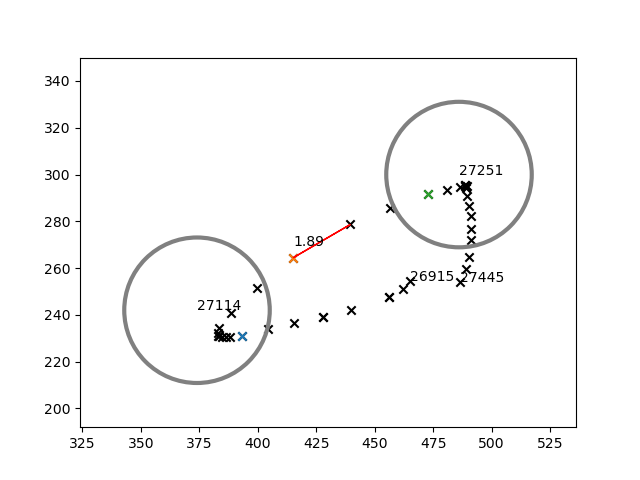

# Replay Analysis for PP Rework

I will be keeping all the scripts that I use for finding useful information when analysing stuff for **big pp rework**.

## Requirements

Install python 3.6+, I use a lot of f-strings.

```
requests>=2.24.0,<3.0.0
tqdm>=4.0.0,<5.0.0
slider==0.3.0
matplotlib>=3.3.1,<4.0.0
```

Install requirements via pip (please do this only if you are on linux):

`pip install -r src/requirements.txt`

If you are on Windows, I would recommend using `Conda` because for some reason `scipy` required for `slider` won't install.

See how you can install scipy with this one weird trick. Developers will hate you (for using pip and conda both at the same time)
```shell script
conda create -y --name your_creative_environment_name_here python==3.7
conda activate your_creative_environment_name_here
conda install scipy matplotlib
pip install tqdm slider
```

## Usage
### Downloading Replays and Beatmap Info
Set environment variable API_KEY to your api v1 key https://osu.ppy.sh/p/api.

You can do this on linux terminal:

`export API_KEY='my_api_key_goes_here'`

 and you can do this on Windows cmd with:
 
 `set API_KEY='my_api_key_but_on_windows_goes_here'`
 
 This is only required for downloading the replays and beatmap scores. 
 
 Set beatmaps you want to download scores from in `beatmaps.txt`
 
 Run `download_replays.py` and wait. It will download replays in `cache` folder. You can find replays and beatmaps structured as follows:
 
 ```
~/cache
    beatmaps
        145669.osu
        345189.osu
        467821.osu
        ...
    scores
        145669  // beatmap_id
            2158054654.json  // score metadata
            2158054654.lzma  // score replay lzma stream
            ...
        .../    
```

### Extracting data from replays

Run `get_distributions.py`. You'll get results in `data` folder in `{beatmap_id}_{score_id}.npy` format.

### Visualize data

Currently we are only looking for maximum distance between circle hit object pairs. To visualize this information run `
visualize_data.py`.


 